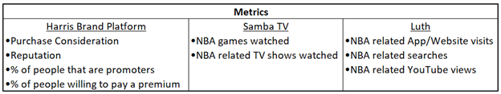
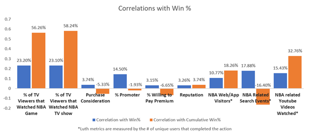

# Impact of NBA Team Performance on Fan Engagement

Basketball

## 1.	Introduction

Winning is the goal of a professional sports team, but does winning impact the overall NBA reputation locally? Munoz showed that winning tends to boost a team’s attendance numbers (Munoz, et al. 2022). I use both localized survey data and passive behavioral data to see how the NBA’s brand image and digital engagement change as the local team wins or loses.

## 2.	Methods

I used data from three different data sources. One was a syndicated brand tracker (Harris Brand Platform) which interviews approximately 900 people a month about the NBA brand from April 2021 to October 2022. This tracker measures many intangibles that are integral to brand health. I combined this data with Samba TV data from the same time period, which provides us with passive viewing behavior of approximately 2.5 million US TV viewers per month. Finally, I integrated digital engagement data from a metered panel called Luth – which takes a permissioned panel of 35,000 US users and measures their activity on digital devices over the same time window. The elements from each data source are shown in the below table.

I aggregated the data by NBA market to get the correlations of these metrics with local team performance. I also looked at metro areas that do not have a team or that are near multiple teams and compared my results in each of the different areas.

## 3.	Results

There seems to be evidence for revenue sharing when looking at local engagement in the NBA with non-playoff teams. I was expecting the playoff viewership to vary by NBA market depending on if the team made it to the playoffs. Surprisingly, while playoff teams have more local viewership during the playoffs than non-playoff teams, both playoff and non-playoff teams have a comparable viewership increase during the playoff window that is unique to the NBA footprint. 

Interestingly, performance in a single month is not as heavily correlated with digital engagement as cumulative season performance to date. Stringing together a winning streak is not enough; rather, what does matter is sustained success. Being a better team is only slightly correlated with local mobile/web interactions. Perhaps most importantly, the NBA’s brand image metrics – such as its brand approval and reputation – in an area were not correlated with the local team’s performance. 

## 4.	Conclusion

Analyzing these disparate sets of data at an aggregate level revealed important insights, including:

•	Being a better team helps increase local viewership, but it does not make a big impact on the league’s overall approval metrics in that area.

•	Areas with no NBA team have considerably lower viewership than areas with a team regardless of team performance. This supports the idea of league expansion, as the increased footprint is most likely to increase viewership.
 
## References

[1] Munoz, Ercio, Chen, Jiadi and Thomas, Milan. "Jumping on the bandwagon? Attendance response to recent victories in the NBA" Journal of Quantitative Analysis in Sports, vol. 18, no. 3, 2022, pp. 161-170. https://doi.org/10.1515/jqas-2020-0092
